# Health & Taste Restaurant 

A sophisticated restaurant reservation system built with React and TypeScript. Customers can browse the menu, select specific tables from an interactive floor plan, and manage reservations — all with a modern, brand-consistent UI.

## Live Application

**Main Site**: [health-and-taste-restaurant-react.up.railway.app](health-and-taste-restaurant-react.up.railway.app)

## 📱 Screenshots

## | Desktop |

|  | 
| 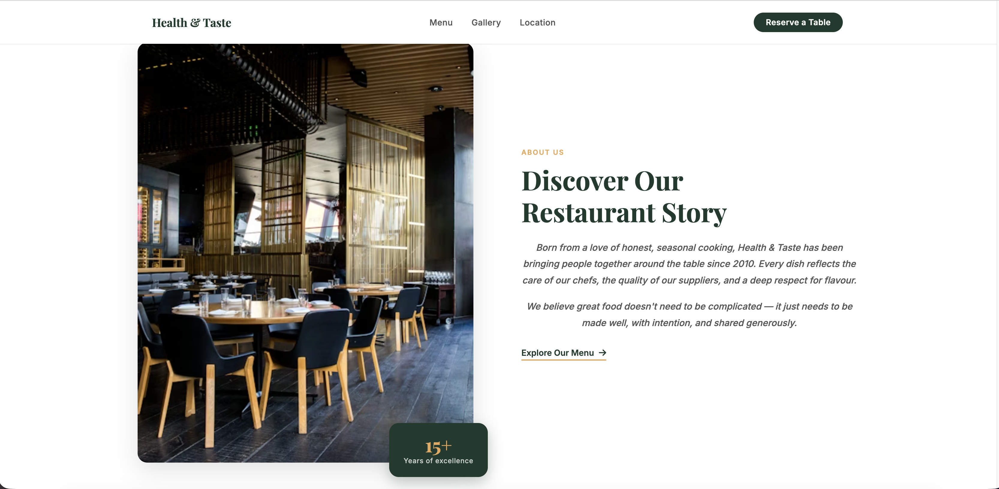 | 
| 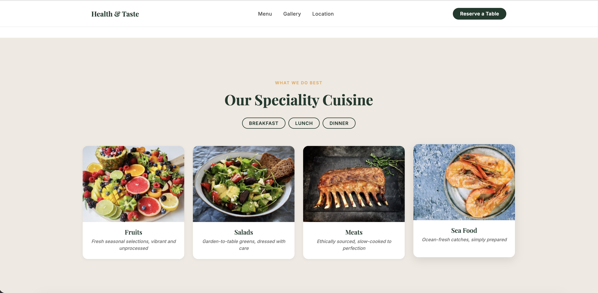 | 
| 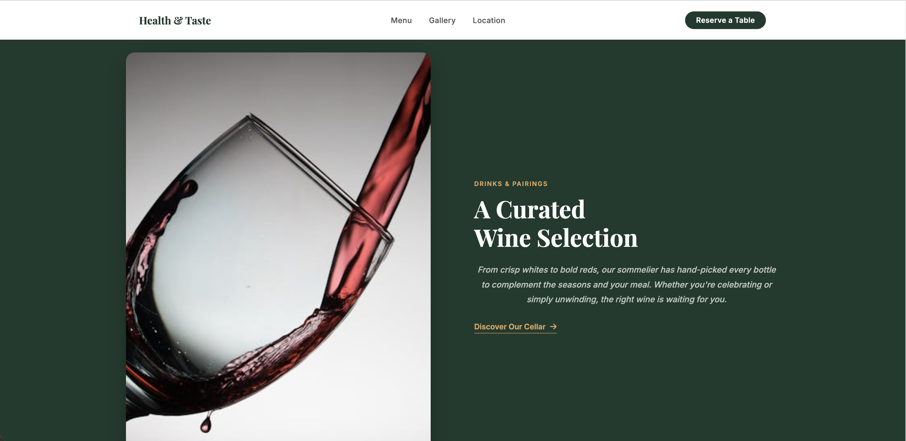 | 
| 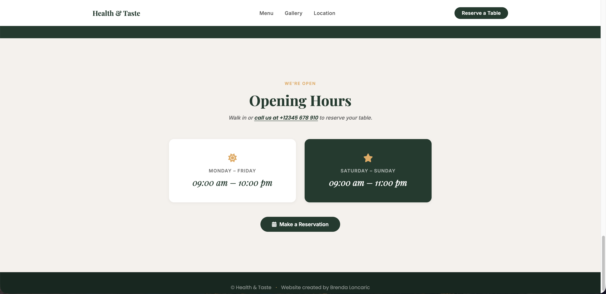 | 
| 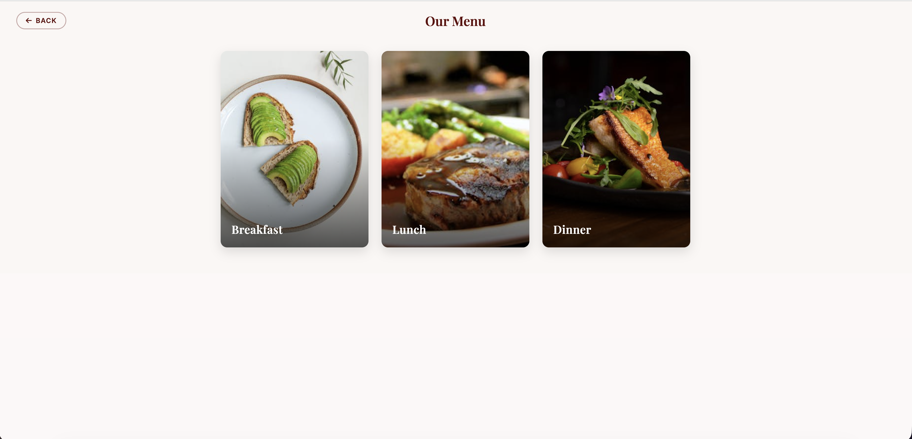 | 
| 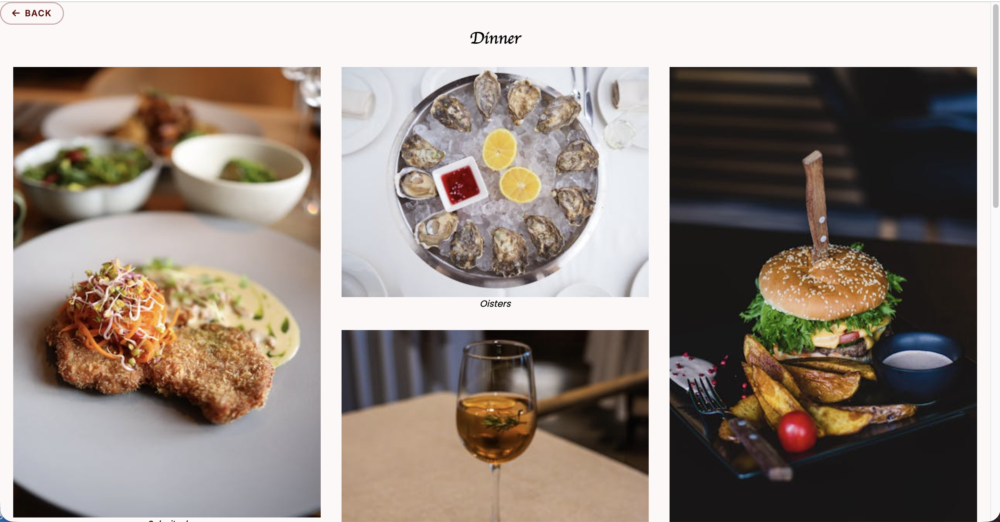 | 
| 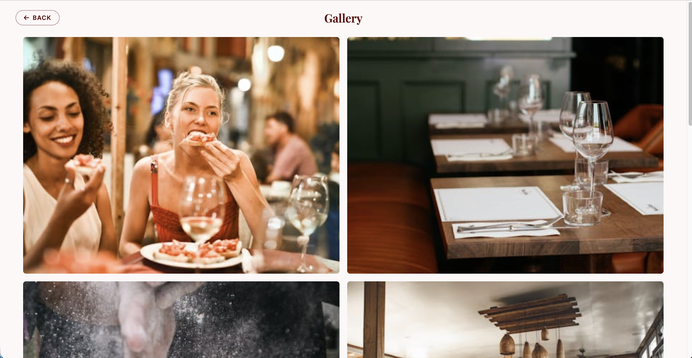 | 
| 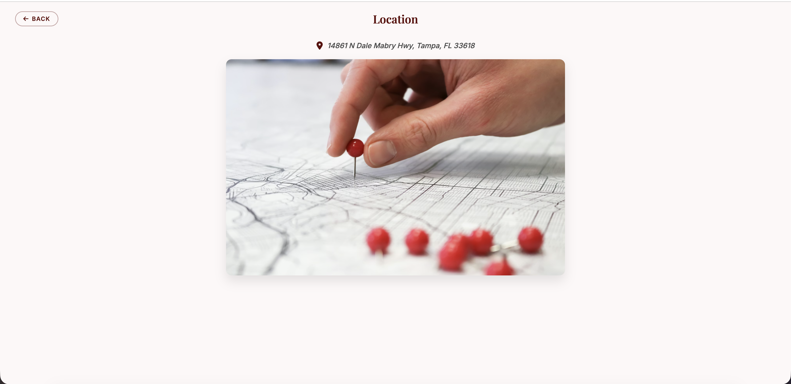 | 
| 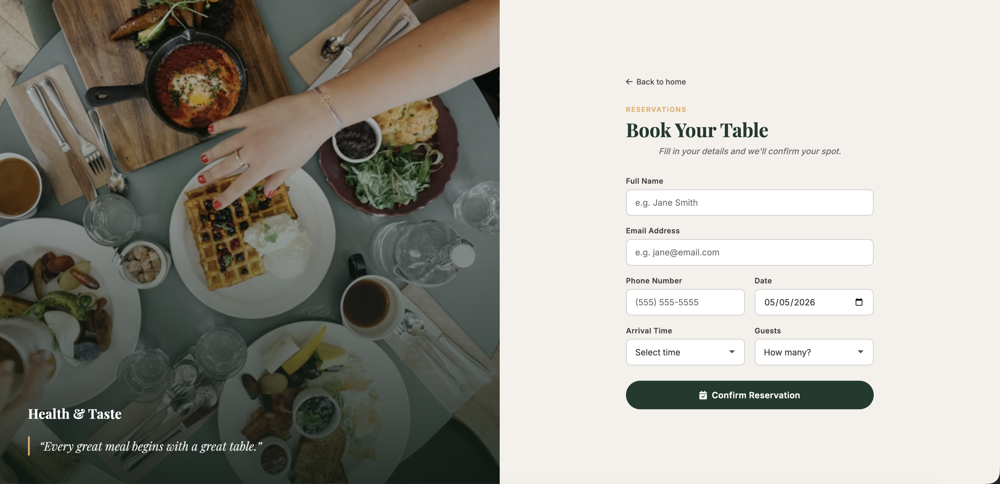 | 
| 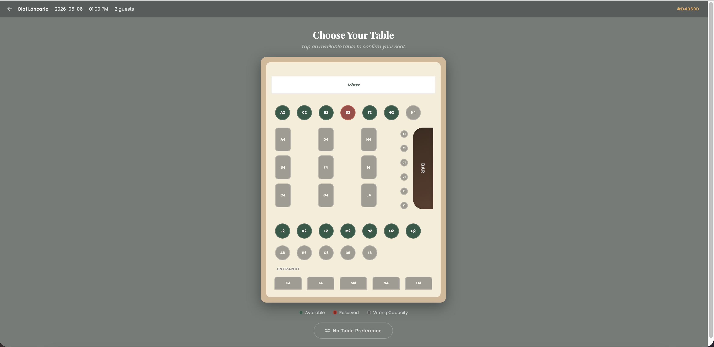 | 
| 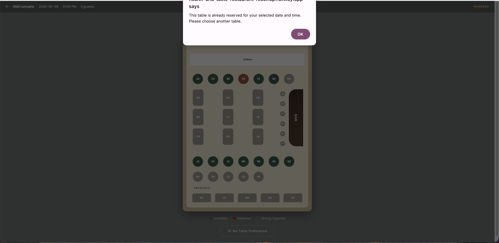 | 
| 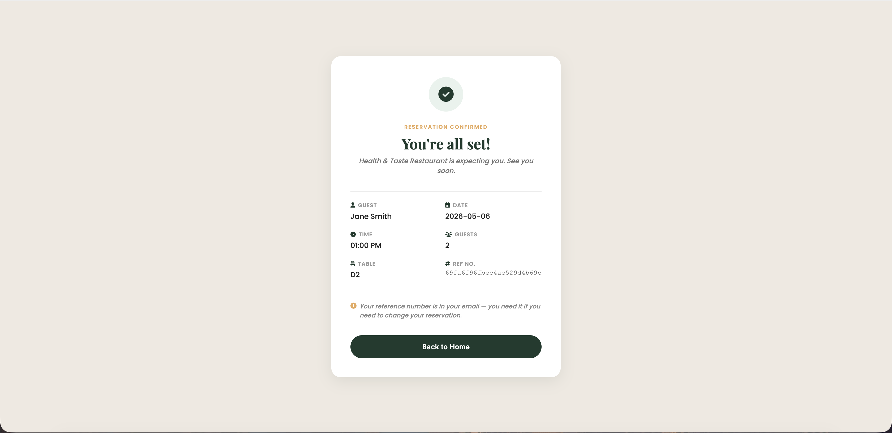 | 
| 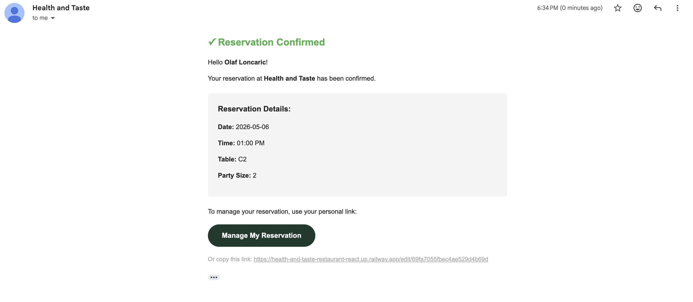 | 
| 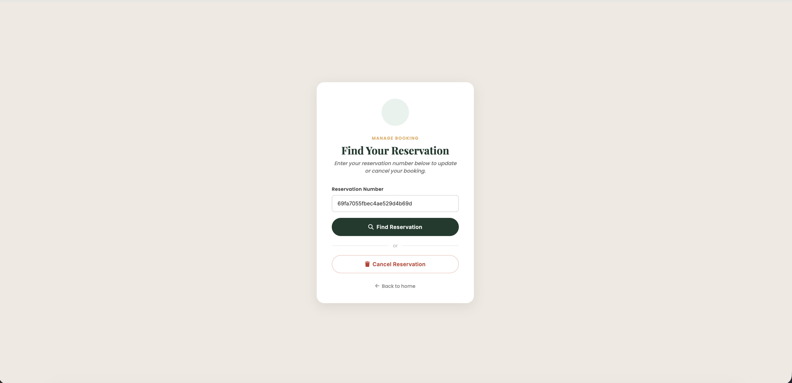 | 

## | Mobile |

## Features

### Customer Features
- **Interactive Menu**: Browse breakfast, lunch, and dinner menus with beautiful food imagery
- **Table Selection**: Choose your preferred table from an interactive restaurant floor plan
- **Smart Reservations**: Dynamic hour selection based on current time and availability
- **Visual Feedback**: Busy tables are highlighted, too-small tables are dimmed
- **Magic Links**: Reservation confirmation emails include a personal link to manage bookings
- **Responsive Design**: Mobile-friendly interface for all devices
- **Gallery**: View restaurant ambiance and food photos

### Reservation Management
- **Email Confirmation**: Users receive a branded confirmation email with a magic link upon booking
- **Edit Reservations**: Modify date, time, or party size using your personal magic link
- **Cancel Reservations**: Cancel directly from the edit page
- **Real-time Validation**: Prevents double-bookings and validates table capacity

## Important Links

### Admin Access
- **Admin Login**: [https://health-and-taste.up.railway.app/admin](https://health-and-taste.up.railway.app/admin)
- Manage all reservations and restaurant operations

### Edit Reservations
- **Edit Portal**: [https://health-and-taste.up.railway.app/edit](https://health-and-taste.up.railway.app/edit)
- Or use the **magic link** sent to your email at the time of booking

## Email Notifications

Powered by **Mailgun**. Upon confirming a reservation, users receive:
- Full booking details (date, time, table, party size)
- A personal magic link to edit or cancel — no account required

## Technology Stack

| Layer | Technologies |
|---|---|
| **Frontend** | React 19, TypeScript, Vite 5 |
| **Routing** | React Router v7 |
| **Styling** | CSS Modules, custom CSS, Bootstrap 5.3 |
| **Backend** | Node.js, Express 5 |
| **Database** | MongoDB, Mongoose |
| **Auth** | Passport.js (admin local strategy), express-session |
| **Email** | Mailgun.js |
| **Deployment** | Railway (Docker) |
| **CI/CD** | GitHub Actions |

## Key Features

### Smart Table Management
- Visual top-down floor plan with real-time availability
- Automatic validation for party size vs table capacity
- Busy table detection based on date/time conflicts
- Booking info strip showing guest name, date, time and ref number

### Dynamic Hour Selection
- Shows only remaining hours for same-day reservations
- Full hour range for future date bookings
- Restaurant hours: 12:00 PM – 11:00 PM

### Magic Link Flow
- Every confirmation email contains a pre-filled edit link: `/edit/:reservationId`
- Clicking it opens the manage page with the reservation ID already filled in
- No account or password required

### CI / CD Pipeline
- **CI**: TypeScript type-check, ESLint, and Vite build run on every push and pull request
- **CD**: Automatic deploy to Railway on every merge to `main`

## Pages & Navigation

| Route | Page |
|---|---|
| `/` | Home — landing page with restaurant overview |
| `/menu` | Full menu overview |
| `/breakfast` · `/lunch` · `/dinner` | Individual menu sections |
| `/gallery` | Restaurant and food photography |
| `/location` | Contact and location information |
| `/bookForm` | Make a new reservation |
| `/tables/:id` | Interactive table selection |
| `/final` | Reservation confirmed |
| `/edit` · `/edit/:id` | Manage an existing reservation |
| `/editForm` | Edit reservation details |
| `/finalEdit` | Cancellation confirmed |
| `/admin` | Admin login |
| `/admin/dashboard` | Admin dashboard |

## Project Inspiration

<!-- This project was born after going on a cruise famous for its food in the caribbean.
Because the experience is everything, and its not always about the food but the location and THE VIEW.

Did you know?
19% of adults want to pick their exact table when making a reservation.
National Household Survey 2020 -->

This application addresses the growing demand for personalized dining experiences, allowing customers to choose their preferred seating location — just like they should on a luxury cruise ship.

## Future Enhancements

- [ ] Hide parameters from the URL for editing reservation
- [ ] Improve admin feature for editing the tables